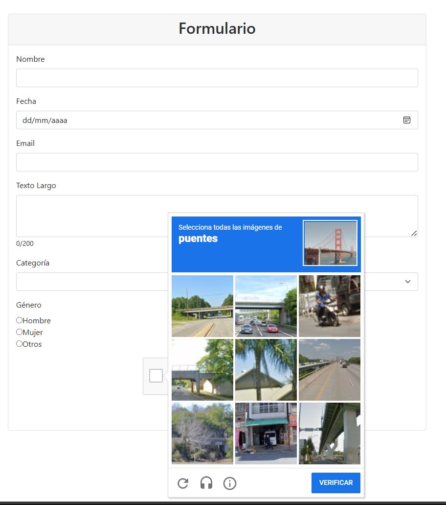

# **Select Language:** 🌍
- [Español (Spanish)](README-es.md)
- [English](README.md)

# Angular Form Validation and MongoDB Integration

Este proyecto es una aplicación Angular que valida los datos de un formulario y los guarda en una base de datos MongoDB a través de un servicio backend. El microservicio del backend está disponible en el siguiente [repositorio](https://github.com/Anyel-ec/Spring-Boot-MongoDB-SaveForm-BackendToAngular).


## RESULTS
### Google reptCATCHA
 
### Validation
 
### Complete Form
 
### Alert 
 
### Mongo DB
 

## Contenido

- [Instalación](#instalación)
- [Configuración](#configuración)
- [Uso](#uso)
- [Estructura del Proyecto](#estructura-del-proyecto)
- [Tecnologías Utilizadas](#tecnologías-utilizadas)
- [Contribuir](#contribuir)
- [Licencia](#licencia)

## Instalación

1. Clona este repositorio en tu máquina local:
    ```sh
    git clone https://github.com/tu-usuario/tu-repositorio.git
    ```
2. Navega a la carpeta del proyecto:
    ```sh
    cd tu-repositorio
    ```
3. Instala las dependencias del proyecto:
    ```sh
    npm install
    ```

## Configuración

1. Asegúrate de tener el backend en ejecución. Puedes encontrar el código del backend y las instrucciones para ejecutarlo en este [repositorio](https://github.com/Anyel-ec/Spring-Boot-MongoDB-SaveForm-BackendToAngular).
2. Configura la URL del backend en el servicio Angular. En `src/app/form.service.ts`, asegúrate de que la constante `baseUrl` apunte a la URL correcta de tu backend:
    ```typescript
    const baseUrl = 'http://localhost:8080/api/formularios';
    ```

## Uso

1. Inicia la aplicación Angular:
    ```sh
    ng serve
    ```
2. Abre tu navegador y navega a `http://localhost:4200`.

## Estructura del Proyecto

```plaintext
src/
|-- app/
|   |-- components/
|   |   |-- form-group/
|   |   |   |-- form-group.component.html
|   |   |   |-- form-group.component.scss
|   |   |   |-- form-group.component.ts
|   |-- services/
|   |   |-- form.service.ts
|   |-- models/
|   |   |-- form.model.ts
|-- assets/
|-- environments/
|-- styles.scss
|-- index.html
|-- main.ts
```

### Formulario Component

```html
<!-- src/app/components/form-group/form-group.component.html -->
<div class="container mt-5">
  <div class="row justify-content-center">
    <div class="col-md-8">
      <div class="card">
        <div class="card-header text-center">
          <h2>Formulario</h2>
        </div>
        <div class="card-body">
          <form [formGroup]="form" (ngSubmit)="save($event)">
            <!-- campos del formulario -->
            <div class="mb-3">
              <label for="name" class="form-label">Nombre</label>
              <input type="text" id="name" class="form-control" formControlName="name">
              <div *ngIf="form.get('name')?.errors && form.get('name')?.touched" class="text-danger">
                <small *ngIf="form.get('name')?.hasError('required')">Este es un campo requerido</small>
              </div>
            </div>
            <!-- otros campos del formulario -->
            <div class="d-flex justify-content-center">
              <button class="btn btn-primary" [disabled]="form.invalid || !captchaValid" type="submit">ENVIAR</button>
            </div>
          </form>
        </div>
      </div>
    </div>
  </div>
</div>
```

### Formulario Service

```typescript
// src/app/services/form.service.ts
import { Injectable } from '@angular/core';
import { HttpClient } from '@angular/common/http';
import { Observable } from 'rxjs';
import { Formulario } from './form.model';

const baseUrl = 'http://localhost:8080/api/formularios';

@Injectable({
  providedIn: 'root'
})
export class FormService {
  constructor(private http: HttpClient) { }

  saveForm(data: Formulario): Observable<any> {
    return this.http.post(baseUrl, data);
  }
}
```

## Tecnologías Utilizadas

- Angular
- Reactive Forms
- Bootstrap
- SweetAlert2
- Google reCAPTCHA
- Spring Boot (para el backend)
- MongoDB (para la base de datos)

## Contribuir

Si deseas contribuir a este proyecto, por favor sigue los siguientes pasos:

1. Haz un fork del repositorio.
2. Crea una nueva rama (`git checkout -b feature/nueva-caracteristica`).
3. Realiza tus cambios y haz commit (`git commit -m 'Agrega nueva característica'`).
4. Envía tus cambios (`git push origin feature/nueva-caracteristica`).
5. Abre un Pull Request.

## Licencia

Este proyecto está licenciado bajo la Licencia MIT. Consulta el archivo [LICENSE](LICENSE) para más detalles.
