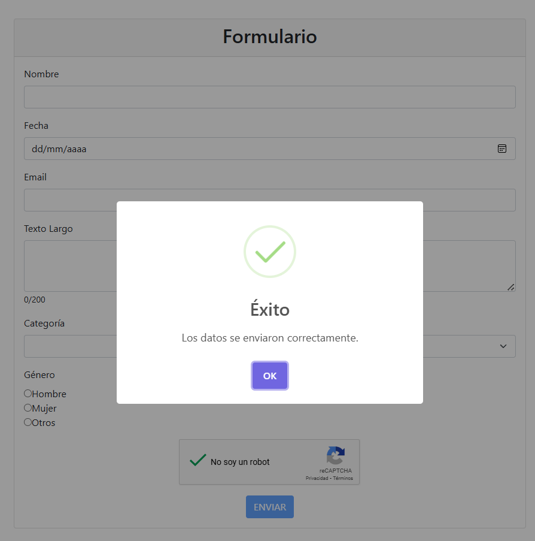
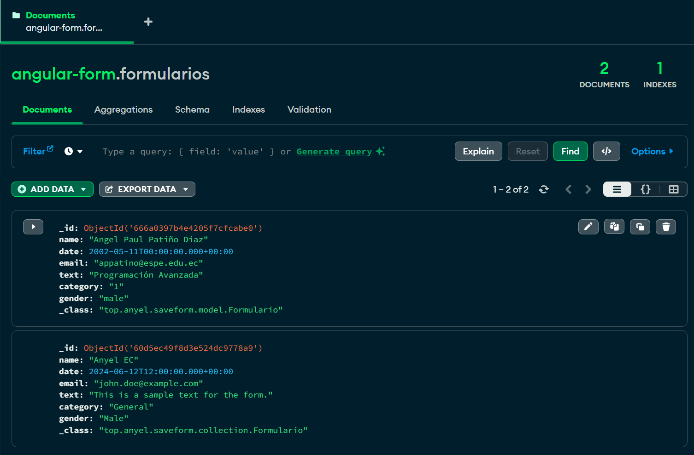

# **Select Language:** 🌍
- [Español (Spanish)](README-es.md)
- [English](README.md)

# Angular Form Validation and MongoDB Integration

This project is an Angular application that validates form data and saves it in a MongoDB database via a backend service. The backend microservice is available in the following [repository](https://github.com/Anyel-ec/Spring-Boot-MongoDB-SaveForm-BackendToAngular).

## RESULTS
### Google reCAPTCHA
 
### Validation
 
### Complete Form
 
### Alert 
 
### MongoDB
 

## Table of Contents

- [Installation](#installation)
- [Configuration](#configuration)
- [Usage](#usage)
- [Project Structure](#project-structure)
- [Technologies Used](#technologies-used)
- [Contributing](#contributing)
- [License](#license)

## Installation

1. Clone this repository to your local machine:
    ```sh
    git clone https://github.com/your-username/your-repository.git
    ```
2. Navigate to the project folder:
    ```sh
    cd your-repository
    ```
3. Install the project dependencies:
    ```sh
    npm install
    ```

## Configuration

1. Ensure you have the backend running. You can find the backend code and instructions for running it in this [repository](https://github.com/Anyel-ec/Spring-Boot-MongoDB-SaveForm-BackendToAngular).
2. Configure the backend URL in the Angular service. In `src/app/form.service.ts`, ensure that the `baseUrl` constant points to the correct URL of your backend:
    ```typescript
    const baseUrl = 'http://localhost:8080/api/formularios';
    ```

## Usage

1. Start the Angular application:
    ```sh
    ng serve
    ```
2. Open your browser and navigate to `http://localhost:4200`.

## Project Structure

```plaintext
src/
|-- app/
|   |-- components/
|   |   |-- form-group/
|   |   |   |-- form-group.component.html
|   |   |   |-- form-group.component.scss
|   |   |   |-- form-group.component.ts
|   |-- services/
|   |   |-- form.service.ts
|   |-- models/
|   |   |-- form.model.ts
|-- assets/
|-- environments/
|-- styles.scss
|-- index.html
|-- main.ts
```

### Form Component

```html
<!-- src/app/components/form-group/form-group.component.html -->
<div class="container mt-5">
  <div class="row justify-content-center">
    <div class="col-md-8">
      <div class="card">
        <div class="card-header text-center">
          <h2>Form</h2>
        </div>
        <div class="card-body">
          <form [formGroup]="form" (ngSubmit)="save($event)">
            <!-- form fields -->
            <div class="mb-3">
              <label for="name" class="form-label">Name</label>
              <input type="text" id="name" class="form-control" formControlName="name">
              <div *ngIf="form.get('name')?.errors && form.get('name')?.touched" class="text-danger">
                <small *ngIf="form.get('name')?.hasError('required')">This field is required</small>
              </div>
            </div>
            <!-- other form fields -->
            <div class="d-flex justify-content-center">
              <button class="btn btn-primary" [disabled]="form.invalid || !captchaValid" type="submit">SUBMIT</button>
            </div>
          </form>
        </div>
      </div>
    </div>
  </div>
</div>
```

### Form Service

```typescript
// src/app/services/form.service.ts
import { Injectable } from '@angular/core';
import { HttpClient } from '@angular/common/http';
import { Observable } from 'rxjs';
import { Formulario } from './form.model';

const baseUrl = 'http://localhost:8080/api/formularios';

@Injectable({
  providedIn: 'root'
})
export class FormService {
  constructor(private http: HttpClient) { }

  saveForm(data: Formulario): Observable<any> {
    return this.http.post(baseUrl, data);
  }
}
```

## Technologies Used

- Angular
- Reactive Forms
- Bootstrap
- SweetAlert2
- Google reCAPTCHA
- Spring Boot (for the backend)
- MongoDB (for the database)

## Contributing

If you wish to contribute to this project, please follow these steps:

1. Fork the repository.
2. Create a new branch (`git checkout -b feature/new-feature`).
3. Make your changes and commit them (`git commit -m 'Add new feature'`).
4. Push your changes (`git push origin feature/new-feature`).
5. Open a Pull Request.

## License

This project is licensed under the MIT License. See the [LICENSE](LICENSE) file for details.
